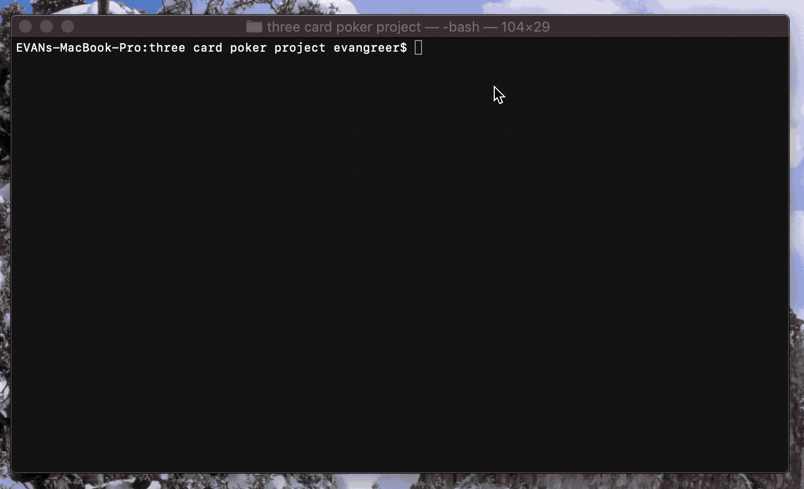

Three Card Poker CLI Game

Description:

Application that simulates three card poker. Allows user to play as many rounds as they'd like or until money runs out. Persists final user purse values to leaderboard table. Then lets user decide to remove their game history from leaderboard and/or reset leaderboard.

Instructions for running: run ruby tools/runner.rb

Three card poker rules:
1) place an ante to see your hand,
2) place an optional pair plus bet for the pair plus bonus (payout: pair 1 to 1, flush 4 to 1, straight: 5 to 1, three of a kind: 30 to 1, straight flush: 40 to 1),
3) you have an option to play or fold based on if you think you will beat the dealer,
4) pair plus pays out regardless of a fold,
5) if you beat the dealer, you win 1 to 1 on the ante and play bet,
6) if the dealer wins, you lose the ante and the play

Prerequisites/Gems:

activerecord,
sinatra-activerecord,
sqlite3, 
rake,
require_all,
rest-client

Built With:

Ruby,
ActiveRecord,
Sqlite3

Authors:

Evan Greer, Jeremy Gray

Acknowledgments:

Deck of Cards API (http://deckofcardsapi.com/)

